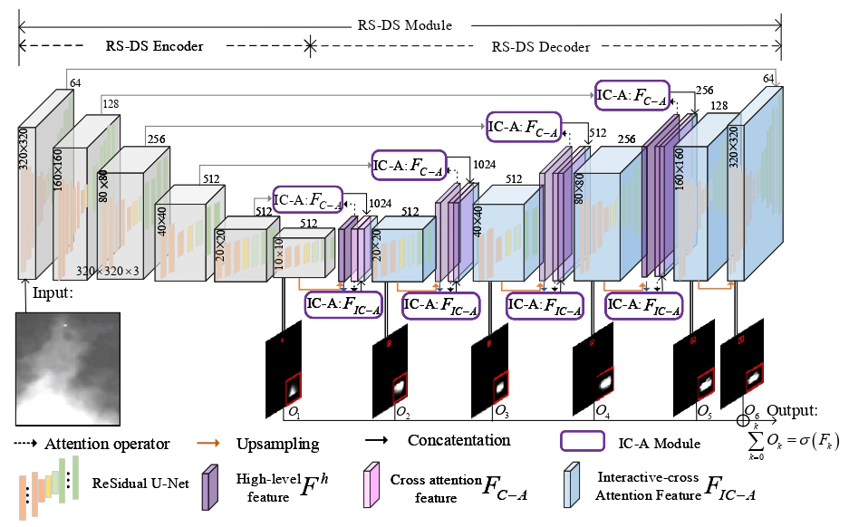

# UIU-Net: U-Net in U-Net for Infrared Small Object Detection

[Xin Wu](https://scholar.google.com/citations?user=XzV9xYIAAAAJ&hl=en), [Danfeng Hong](https://sites.google.com/view/danfeng-hong), [Jocelyn Chanussot](http://jocelyn-chanussot.net/)
---------------------

The code in this toolbox implements the ["UIU-Net: U-Net in U-Net for Infrared Small Object Detection"](https://ieeexplore.ieee.org/document/9989433).
More specifically, it is detailed as follow.

Citation
---------------------

**Please kindly cite the papers if this code is useful and helpful for your research.**

X. Wu, D. Hong, J. Chanussot. UIU-Net: U-Net in U-Net for Infrared Small Object Detection, IEEE Trans. Image. Process., 2023, 32: 364-376. 

     @article{wu2023uiu,
      title     = {UIU-Net: U-Net in U-Net for Infrared Small Object Detection},
      author    = {X. Wu and D. Hong and J. Chanussot},
      journal   = {IEEE Trans. Image. Process.}, 
      volume    = {32},
      pages     = {364--376},
      year      = {2023},
      publisher = {IEEE}
     }

System-specific notes
---------------------
Please refer to the file of `requirements.txt` for the running enviroment of this code.

:exclamation: The model in `saved_models/uiunet` can be downloaded from the following baiduyun:

Baiduyun: https://pan.baidu.com/s/11JSqFKxq7XTvTzgOIWfdOg  (access code: eu9f)

Licensing
---------

Copyright (C) 2022 Danfeng Hong

This program is free software: you can redistribute it and/or modify it under the terms of the GNU General Public License as published by the Free Software Foundation, version 3 of the License.

This program is distributed in the hope that it will be useful, but WITHOUT ANY WARRANTY; without even the implied warranty of MERCHANTABILITY or FITNESS FOR A PARTICULAR PURPOSE. See the GNU General Public License for more details.

You should have received a copy of the GNU General Public License along with this program.

Contact Information:
--------------------

Danfeng Hong: hongdanfeng1989@gmail.com 
Danfeng Hong is with the Aerospace Information Research Institute, Chinese Academy of Sciences, 100094 Beijing, China.

